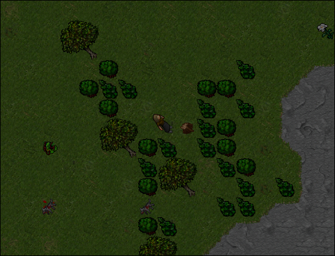

# woodie-fiesta

Automated lumberjack for [Darkrest Online](https://darkrest.online/?news).

Continuously search for map waypoints using image recognition to gather wood.

Features include: `auto lumberjack` and `mana trainer`.
>[!NOTE] 
>[Lumberjacking](https://darkrest-online.gitbook.io/darkrest.online-wiki/gathering-and-crafting/gathering) is the process of chopping down trees to gather wood.



## Usage

### Prerequisites

>[!NOTE]
>Ensure that you have [Conda](https://www.anaconda.com/download/) installed on your system.

```bash
# clone this repository
git clone https://github.com/emmacyberia/woodie-fiesta.git

cd woodie-fiesta

# create a conda environment and install dependencies
conda env create --name woodie-fiesta -f environment.yml

# activate the environment
conda activate woodie-fiesta
```

>[!NOTE]
>Before running, ensure that the configuration file is set up properly.
>Edit the [configuration file](https://github.com/emmacyberia/woodie-fiesta/blob/main/woodie-fiesta/core/config.py) to match your desired settings.

### Run woodie-fiesta

```bash
# run the lumberjack bot
python woodie-fiesta/main.py
```

>[!NOTE]
>Run [locateOnScreen.py](https://github.com/emmacyberia/woodie-fiesta/blob/main/utils/locateOnScreen.py) to capture screen coordinates.
>
>You also have to set the waypoints route in your MINIMAP using [screenshot.py](https://github.com/emmacyberia/woodie-fiesta/blob/main/utils/screenshot.py)

After adding coordinates to [config.py](https://github.com/emmacyberia/woodie-fiesta/blob/main/woodie-fiesta/core/config.py), run the bot, minimize it, and press `p` in-game to start.


## Ingame hotkeys

```
Mana trainer (adori vis // adura vita) = F3
```

## Achievements
> Collected more than 13.000 Dried Sticks, 5.000 Sticks, 3.500 Old Woods, 2.400 Roots, 1.600 Strange Roots, 950 Magic Woods and 500 Steel Woods.
